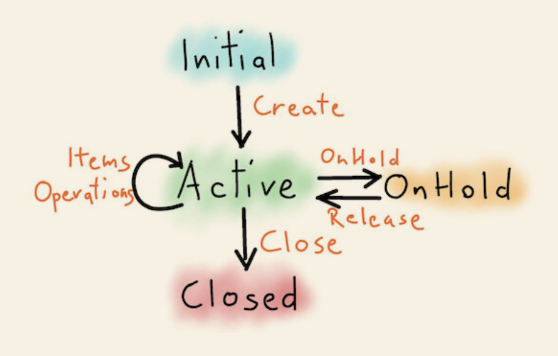

# Zettai

An implementation of the Zettai application based on the book
[From Objects to Functions by Uberto Barbini](https://pragprog.com/titles/uboop/from-objects-to-functions/).
This application serves the purpose of a TODO list manager, while focusing on
functional programming aspects.

## Entity States

The project contains 2 main entities, `User` and `ToDoList`.

The `ToDoList` entity has 4 states:
- Initial
- Active
- OnHold
- Closed

The following diagram describes the transitions between the states:

